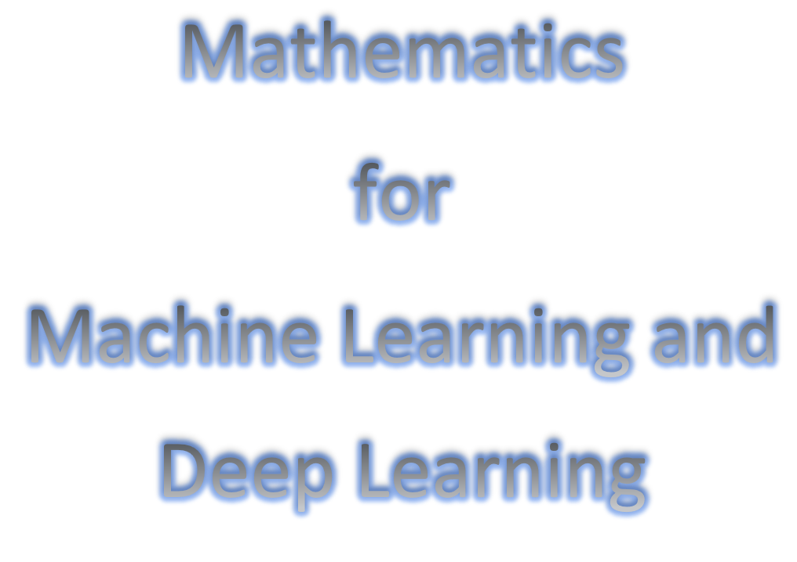
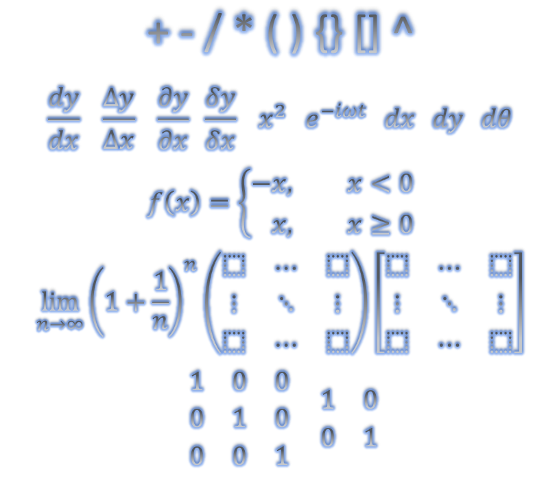

[![LinkedIn][linkedin-shield]][linkedin-url]
 

<!-- MARKDOWN LINKS & IMAGES -->
<!-- https://www.markdownguide.org/basic-syntax/#reference-style-links -->
[linkedin-shield]: https://img.shields.io/badge/-LinkedIn-black.svg?style=for-the-badge&logo=linkedin&colorB=555
[linkedin-url]: https://linkedin.com/in/adi-dom

# Mathematics for Machine Learning and Deep Learning

##  Description:    
This tutorial provides an overview of Mathematics in Machine Learning and Deep Learning, including step-by-step explanations and examples of math problems in these fields. Its aim is to enhance your understanding of mathematics in relation to machine learning and deep learning education. :symbols: :1234:  

## Prerequisites:
Python 3.0 +  
Use jupyter notebook  

## List of Mathematics:
### Basic Mathemathics  
- Addition, Subtraction, Multiplication, Division, Square Root, and Algebra.
### Geometry  
- Shapes, Area, Perimeter, Volume, Points, Lines, Angles, Surfaces, Planes, and Curves
### Statistics 
- Data collection, Data Analysis, Probability, Average, Median, Mode, Standard Deviation, and Variances 
### Calculus  
- Instantaneous rates of change and Slopes of curves, Differential, Integral, Series, Vector, and Multivariable
### Linear Algebra  
- Matrices, Vector Spaces, Linear Systems,  Gaussian elimination, Linear Systems, Determinant, Eigenvalues and eigenvectors
##
## Author:  
* Aditya Kumar
